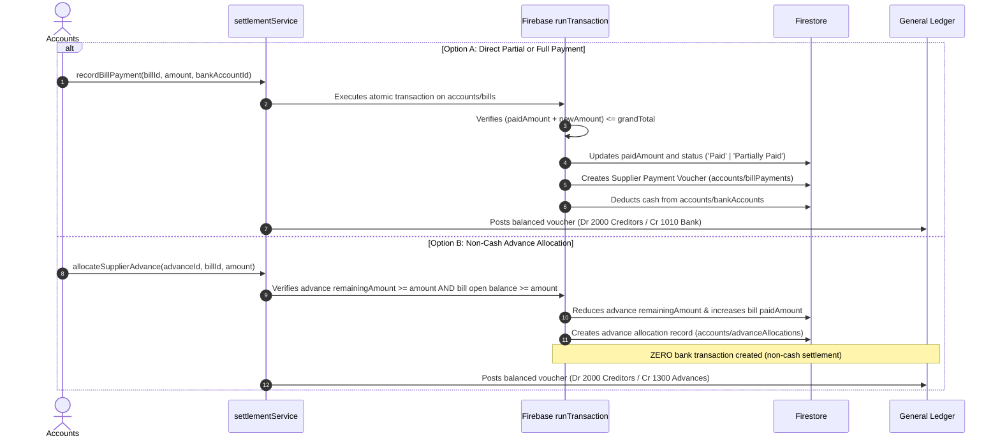
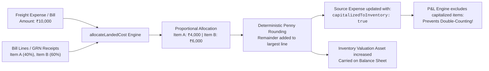

# FCS ERP Accounts & Finance Module
## Architecture, Workflows, Data Models & Operational Guide

---

## 1. Executive Overview & System Philosophy

The **FCS ERP Accounts & Finance Module** is an enterprise-grade financial management, procurement verification, manufacturing cost accounting, and double-entry general ledger system designed for manufacturing enterprises (specifically polymers, rubber moulding, and industrial components).

### Core Philosophical Principles

1. **Clear Domain Ownership & Zero Synthetic Records**
   - **Sales Ownership**: Customer sales orders, invoices (`sales/invoices`), customer collections, and AR credit limits originate in and are strictly owned by the Sales module. Finance provides collection visibility, 5-bucket ageing analysis, and statement reporting linked directly to verified sales records.
   - **Stores & Production Ownership**: Physical Goods Receipt Notes (`stores/grn`), raw material inventory (`stores/raw`), work in progress (`stores/wip`), finished goods (`stores/fg`), and production jobs (`production/jobs`) are owned by warehouse and shop-floor operations. Finance performs advisory 3-way matching and cost calculations **without mutating physical stock quantities or creating synthetic inventory movements**.
   - **Finance Ownership**: Finance owns supplier bills (`accounts/bills`), supplier settlements, disbursements, advances, debit notes, fixed assets (`accounts/fixedAssets`), general ledger vouchers (`accounts/journals`), the Chart of Accounts (`accounts/chartOfAccounts`), accounting period locks, and statutory/management reporting.

2. **Strict Double-Entry Invariant**
   - Every financial voucher posted to the General Ledger strictly enforces:
     $$\sum \text{Debits} \equiv \sum \text{Credits}$$
   - Negative line amounts are forbidden.
   - Unbalanced entries and single-line entries are rejected at the service layer.

3. **Zero Balancing Plugs & Truthful Reporting**
   - In financial statements such as the Trial Balance and Inventory Valuation Reconciliation, any discrepancy between debits and credits or between physical stock value and GL Account 1400 is **honestly reported as an explicit variance**.
   - Synthetic "suspense" accounts, plug figures, or artificial adjustments are never injected to force statements to balance.

4. **Immutable Reciprocal Reversals**
   - Posted general ledger vouchers and approved financial adjustments cannot be deleted or mutated in-place.
   - Reversing a transaction creates a linked **reciprocal voucher** (`REV-...`) with inverted Debits and Credits. Both the original and reciprocal entries remain permanently in the ledger, netting to zero while preserving a complete audit trail.

5. **Concurrency-Safe Decimal Arithmetic**
   - All monetary calculations avoid standard IEEE 754 floating-point hazards (e.g., $0.1 + 0.2 = 0.30000000000000004$) by routing through a centralized decimal arithmetic engine with deterministic 2-decimal half-up rounding.
   - Concurrency-sensitive operations (such as bill payments and advance allocations) execute within atomic transactions to prevent race conditions and over-settlements.

---

## 2. End-to-End System Architecture

```mermaid
flowchart TD
    subgraph Operational_Layers["Shop-Floor & Warehouse Ground Truth"]
        direction TB
        SO["Sales Orders & Invoices<br/><code>sales/invoices</code>"]
        GRN["Goods Receipt Notes (GRN)<br/><code>stores/grn</code>"]
        Stock["Physical Inventory Stores<br/><code>stores/raw, wip, fg</code>"]
        Jobs["Production Jobs & Work Orders<br/><code>production/jobs</code>"]
    end

    subgraph Finance_Procurement["Procurement Settlement & Payables"]
        Bills["Vendor Bills & Subcontractor Bills<br/><code>accounts/bills</code>"]
        Matching["3-Way Matching Engine<br/><code>accounts/billGrnMatches</code>"]
        Advances["Supplier Advances & Allocations<br/><code>accounts/supplierAdvances</code>"]
        Credits["Debit Notes & Adjustments<br/><code>accounts/supplierCredits</code>"]
        LandedCosts["Landed Cost Allocator<br/><code>accounts/landedCostAllocations</code>"]
    end

    subgraph Manufacturing_Costing["Manufacturing Cost Accounting Engine"]
        Valuation["Inventory Valuation<br/>RM, WIP (Stage Multipliers), FG"]
        Costing["Production Job Costing<br/>Materials + Labour + Overhead - Scrap"]
        Profitability["Product Profitability Engine<br/>Revenue vs COGS on Units Sold"]
    end

    subgraph Core_Accounting["General Ledger & Double-Entry Engine"]
        Journals["Unified Voucher Backing Store<br/><code>accounts/journals</code>"]
        COA["Chart of Accounts Register<br/><code>accounts/chartOfAccounts</code>"]
        FixedAssets["Fixed Assets & Depreciation<br/><code>accounts/fixedAssets</code>"]
        PeriodLocks["Period Lock Enforcement<br/><code>accounts/periodLocks/current</code>"]
        BankRecon["Bank Reconciliation & CSV Import<br/><code>accounts/bankAccounts</code>"]
    end

    subgraph Output_and_Integration["Financial Reporting & External Exports"]
        Reports["P&L · Balance Sheet · Cash Flow (8-Week)<br/>Multi-Column Trial Balance · Party Statements"]
        Tally["TallyPrime XML Voucher Exporter<br/><code>accounts/tallyExports</code>"]
    end

    %% Operational to Procurement
    GRN -.->|Advisory Qty & Price Check| Matching
    Bills <---> Matching
    Bills --> LandedCosts
    Advances -->|Non-Cash Allocation| Bills
    Credits -->|Liability Reduction| Bills

    %% Cost Accounting
    Bills --> Valuation
    GRN --> Valuation
    Stock --> Valuation
    Jobs --> Costing
    Bills -.->|Subcontractor Charges| Costing
    SO --> Profitability
    Costing --> Profitability

    %% Accounting Postings
    Bills -->|Dr 5000 / Cr 2000| Journals
    Advances -->|Dr 1300 / Cr 1010| Journals
    Credits -->|Dr 2000 / Cr 5000| Journals
    FixedAssets -->|Dr 5500 / Cr 1510| Journals
    PeriodLocks -->|Blocks prior dates| Journals
    Journals --> Reports
    Journals --> Tally
    Valuation -.->|Reconciles with 1400| Reports
    FixedAssets -.->|Net Carrying Value| Reports
```



---

## 3. Screen & Navigation Map

All Finance screens are routed under `/finance/*` in [`src/App.tsx`](file:///g:/CODE/Texa_Fas_Demo_Aug/src/App.tsx) and managed by the top navigation tabs in [`src/modules/accounts/AccountsLayout.tsx`](file:///g:/CODE/Texa_Fas_Demo_Aug/src/modules/accounts/AccountsLayout.tsx):

| URL Route | Module Component | Purpose & Scope |
|-----------|------------------|-----------------|
| `/finance` | `AccountsDashboard.tsx` | High-level financial cockpit: Income, Expenses, Cash, Receivables, Payables, 5-Bucket Ageing distributions, and Cash Flow previews. |
| `/finance/invoicing` | `AccountsInvoicing.tsx` | Customer receivables tracking, customer collection status, overdue summaries, and collection follow-up links. |
| `/finance/expenses` | `Expenses.tsx` | Multi-tab procurement and payables hub: Vendor Bills, Operating Expenses, PO-GRN-Bill 3-Way Matching, Debit Notes, and Landed Cost Allocations. |
| `/finance/fixed-assets` | `FixedAssets.tsx` | Fixed Asset Register, SLM and WDV periodic depreciation runs, salvage floor enforcement, and automated double-entry GL journal posting. |
| `/finance/banking` | `Banking.tsx` | Bank account management, manual transaction entries, Bank CSV statement uploads, SHA-256 duplicate checking, and reconciliation matching. |
| `/finance/coa` | `ChartOfAccounts.tsx` | Chart of Accounts hierarchy, default system accounts protection, account activation/deactivation, and running ledger statement drilldown. |
| `/finance/journals` | `ManualJournals.tsx` | Unified General Ledger voucher register, balanced double-entry manual entries, period lock settings, controlled activation, and reciprocal reversals. |
| `/finance/reports` | `AccountsReports.tsx` | Comprehensive financial reporting: P&L, 8-Week Rolling Cash Flow Forecast, Balance Sheet, Inventory Valuation, Production Costing, Product Profitability, AR/AP Ageing, Party Statements, Trial Balance, and Tally XML Exporter. |
| `/finance/currency` | `CurrencyAdjustments.tsx` | Multi-currency exchange rate adjustments, realized/unrealized forex gains and losses tracking. |

---

## 4. Comprehensive Business Workflows

### Workflow 1: Vendor Bill Processing & 3-Way Procurement Matching

```mermaid
sequenceDiagram
    autonumber
    actor Supplier
    actor Stores
    actor Accounts
    participant DB as Firestore
    participant GL as General Ledger

    Stores->>DB: Inspects shipment & records Goods Receipt Note (GRN) in stores/grn
    Supplier->>Accounts: Delivers physical/digital invoice
    Accounts->>DB: Records Vendor Bill (accounts/bills)
    Note over Accounts,DB: Bill status: "Pending Verification"
    Accounts->>DB: Performs 3-Way Match (procurementMatchingService)
    DB-->>Accounts: Compares bill lines vs GRN qty, unit rate, and PO ref
    alt Shortage or Price Discrepancy
        Accounts->>Accounts: Flags "Advisory Discrepancy" (warns Accounts, preserves bill)
    else Fully Matched
        Accounts->>DB: Confirms match; cumulative qty logged in accounts/billGrnMatches
        Note over DB: Prevents GRN from being consumed by another bill
    end
    Accounts->>GL: Auto-posts balanced voucher (Dr 5000 Purchase / Cr 2000 Creditors)
```

#### Detailed Operational Rules:
1. **Advisory Matching**: Mismatches do not lock physical inventory. Stores remain the ground truth for stock, while Finance reviews discrepancies.
2. **Cumulative Consumption Protection**: When a bill consumes $300\text{ kg}$ of a $500\text{ kg}$ GRN receipt, only $200\text{ kg}$ remains available for subsequent bills. Subsequent bills cannot consume more than the unbilled balance.

---

### Workflow 2: Concurrency-Safe Bill Settlement & Advance Allocation



#### Detailed Operational Rules:
1. **Concurrency Safety**: If two accounts users attempt to settle the same bill simultaneously, `runTransaction` ensures only the first succeeds up to the grand total, preventing over-settlement.
2. **Traceable Reversals**: Allocations can be reversed with a mandatory audit reason. Reversing restores the advance remaining balance and increases the bill outstanding balance.

---

### Workflow 3: Purchase Returns & Supplier Debit Notes

```mermaid
sequenceDiagram
    autonumber
    actor Stores
    actor Accounts
    participant Service as settlementService
    participant DB as Firestore
    participant GL as General Ledger

    Stores->>DB: Records rejected return shipment in stores/grn
    Accounts->>Service: recordSupplierCredit(vendorName, amount, returnRef, settlementEffect)
    Service->>DB: Creates Debit Note DN-XXXXXX in accounts/supplierCredits
    alt Settlement Mode: ReduceBillBalance
        Service->>DB: Automatically applies DN to open bill; reduces payable liability
        Service->>GL: Posts Dr 2000 Creditors / Cr 5000 Purchase Returns
    else Settlement Mode: RefundCash
        Service->>DB: Records bank deposit transaction in accounts/bankTransactions
        Service->>GL: Posts Dr 1010 Bank / Cr 5000 Purchase Returns
    else Settlement Mode: KeepAsCreditNote
        Service->>DB: Retains remainingAmount in accounts/supplierCredits for future allocations
    end
```

---

### Workflow 4: Landed Cost Allocation & Non-Duplication in P&L

Freight, customs, port handling, and shipping charges must be capitalized into raw material inventory rather than expensed immediately:



#### Deterministic Penny Rounding Algorithm:
When allocating fractional landed costs (e.g. ₹100 distributed equally across 3 items):
1. **Pass 1**: Each line receives $\text{roundCurrency}(100 \times \frac{1}{3}) = 33.33$.
2. **Sum Check**: $33.33 + 33.33 + 33.33 = 99.99$. Remainder is $100.00 - 99.99 = +0.01$.
3. **Pass 2**: Remainder is automatically added to the line with the largest allocation:
   $$\text{Line 1} = 33.34,\quad \text{Line 2} = 33.33,\quad \text{Line 3} = 33.33 \implies \sum = 100.00$$

---

### Workflow 5: Manufacturing Cost Accounting & Inventory Valuation

#### 1. Three-Tier Inventory Valuation (`calculateInventoryValuation`)
- **Raw Materials (`stores/raw`)**: Derives purchase rates from approved vendor bills (`accounts/bills`) and GRNs (`stores/grn`) using token-based compound matching (`NBR-70-BLK`, `EPDM-60`).
- **Work In Progress (`stores/wip`)**: Applies stage conversion multipliers atop base raw material cost:
  - Mixing: $+20\%$
  - Moulding: $+45\%$
  - Curing: $+65\%$
  - Finishing: $+85\%$
  - QC Pending: $+95\%$
- **Finished Goods (`stores/fg`)**: Evaluates finished stock against completed production job costs or standard BOM benchmarks ($1.95\times$ base compound cost).
- **GL 1400 Reconciliation**: Reconciles total physical valuation against GL Account `1400 - Inventory`:
  $$\text{Unreconciled Variance} = \text{Total Physical Stock Valuation} - \text{GL Account 1400 Balance}$$
- **Missing-Cost Exceptions Drawer**: Any inventory item lacking a verified purchase bill or GRN rate is flagged in an explicit exceptions drawer with item code, category, and quantity. Unknown costs are never plugged or concealed.

#### 2. Production Job Costing (`calculateProductionCosting`)
$$\text{Total Job Cost} = \text{Direct Materials} + \text{Direct Labour} + \text{Subcontracting} + \text{Factory Overhead} - \text{Scrap Credit}$$
- **Incomplete Jobs (WIP)**: Unit cost is set to ₹0.00 and classified as `WIP Accumulated` to prevent premature margin distortion.
- **Zero-Output Jobs (Setup / Trial Scrap Runs)**: Unit cost is set to ₹0.00 without division-by-zero errors. Total incurred setup cost is accumulated as period manufacturing loss.
- **Completed Jobs**: Actual unit cost is computed ($\frac{\text{Total Cost}}{\text{Output Qty}}$) and compared against standard estimates for variance analysis.

#### 3. Product Profitability & The Unit Sold Matching Principle (`calculateProductProfitability`)
$$\text{COGS Sold} = \text{Units Sold} \times \text{Unit Manufacturing Cost}$$
$$\text{Gross Profit} = \text{Sales Revenue} - \text{COGS Sold}$$
- **Asset Retention**: Unsold finished goods are **not** expensed in the current period. They remain capitalized on the Balance Sheet ($\text{Unsold Qty} \times \text{Unit Cost}$) as Inventory Assets.

---

### Workflow 6: Fixed Assets Register & Depreciation Engine

1. **Asset Master Register (`accounts/fixedAssets`)**:
   - Captures Asset Name, Asset Number (`AST-YYYY-XXXX`), Category, Purchase Cost, Salvage Value, Useful Life, and Depreciation Method (Straight-Line or Written Down Value).
2. **Depreciation Formulas**:
   - **Straight-Line Method (SLM)**:
     $$\text{Monthly Depreciation} = \frac{\text{Purchase Cost} - \text{Salvage Value}}{\text{Useful Life in Years} \times 12}$$
   - **Written Down Value (WDV)**:
     $$\text{Monthly Depreciation} = \frac{\text{Net Book Value} \times \text{Depreciation Rate}\%}{12}$$
3. **Salvage Value Floor Protection**:
   - Depreciation automatically caps so that $\text{Net Book Value} \ge \text{Salvage Value}$. Once Net Book Value reaches the salvage floor, monthly depreciation drops to ₹0.00.
4. **Duplicate-Period Prevention**:
   - Before executing a depreciation run, the engine checks `accounts/depreciationRuns` for existing non-reversed runs in that period (e.g. `2026-06`). Re-running depreciation for an already processed period is strictly blocked.
5. **Automated Balanced GL Posting**:
   - Executes a unified journal voucher:
     - **Debit Account 5500** (Depreciation Expense)
     - **Credit Account 1510** (Accumulated Depreciation)

---

### Workflow 7: Prospective Manufacturing Cash-Flow Forecasting

The prospective 8-week cash flow schedule projects liquidity forward from the selected as-of date:

$$\text{Projected Closing Cash} = \text{Opening Cash} + \text{Receivables (AR Inflow)} - \text{Payables (AP Outflow)} - \text{Unbilled PO Commitments} - \text{Factory Overheads}$$

```mermaid
flowchart TD
    CurrentCash["Live Cash & Bank Balance<br/><code>accounts/bankAccounts</code>"] --> Bucket1["Week 1 Bucket"]
    AR["Open Sales Invoices due in week<br/><code>sales/invoices</code>"] -->|Inflow (+)| Bucket1
    AP["Open Vendor Bills due in week<br/><code>accounts/bills</code>"] -->|Outflow (-)| Bucket1
    PO["Unbilled Purchase Orders due in week<br/><code>stores/grn</code>"] -->|Outflow (-)| Bucket1
    OH["Factory Overheads Provision<br/>(₹120,000/mo prorated)"] -->|Outflow (-)| Bucket1
    BilledCheck["Billed PO Exclusion Engine:<br/>Strictly filters out POs already in accounts/bills!"] --> PO
    Bucket1 --> Closing1["Week 1 Closing Balance"]
    Closing1 --> Bucket2["Week 2 Bucket... up to Week 8"]
```

#### Elimination of Double-Counting:
If a Purchase Order has already been invoiced into an open Vendor Bill in `accounts/bills`, it is **strictly excluded from unbilled PO commitments**. This prevents the same operational liability from being deducted twice in the forecast.

---

### Workflow 8: Tally XML Voucher Exporter

The Tally export engine generates standard TallyPrime / Tally ERP 9 XML envelopes for direct import via **Gateway of Tally > Import Data > Vouchers**:

1. **Envelope Architecture**:
   ```xml
   <ENVELOPE>
     <HEADER><TALLYREQUEST>Import Data</TALLYREQUEST></HEADER>
     <BODY>
       <IMPORTDATA>
         <REQUESTDESC>
           <REPORTNAME>All Masters</REPORTNAME>
           <STATICVARIABLES><SVCURRENTCOMPANY>Company Name</SVCURRENTCOMPANY></STATICVARIABLES>
         </REQUESTDESC>
         <TALLYDATA>
           <TALLYMESSAGE xmlns:UDF="TallyUDF">
             <VOUCHER VCHTYPE="Journal" ACTION="Create">
               <DATE>20260630</DATE>
               <VOUCHERNUMBER>JV-2026-001</VOUCHERNUMBER>
               <!-- Ledger Entries -->
             </VOUCHER>
           </TALLYMESSAGE>
         </TALLYDATA>
       </IMPORTDATA>
     </BODY>
   </ENVELOPE>
   ```
2. **Negative Debit Sign Convention**:
   - In Tally XML, debits are formatted as **negative amounts** (`<AMOUNT>-2500.00</AMOUNT>`) with `<ISDEEMEDPOSITIVE>Yes</ISDEEMEDPOSITIVE>`.
   - Credits are formatted as **positive amounts** (`<AMOUNT>2500.00</AMOUNT>`) with `<ISDEEMEDPOSITIVE>No</ISDEEMEDPOSITIVE>`.
3. **Automated Ledger Name Resolution**:
   - Maps FCS numeric account codes to standard Tally ledger names:
     - `1000` $\to$ `Cash`
     - `1010` $\to$ `Bank Accounts`
     - `1200` $\to$ `Sundry Debtors`
     - `1400` $\to$ `Stock-in-Hand`
     - `1500` $\to$ `Fixed Assets`
     - `1510` $\to$ `Accumulated Depreciation`
     - `2000` $\to$ `Sundry Creditors`
     - `5000` $\to$ `Purchase Accounts`
     - `5500` $\to$ `Depreciation`
4. **Batch History Logging**:
   - Every export creates an audit log in `accounts/tallyExports` with timestamp, voucher count, date window, and user attribution.

---

## 5. Firebase Schema & Storage Specifications

| Storage Path | Entity Description | Primary Key | Key Fields & Data Types |
|--------------|-------------------|-------------|-------------------------|
| `accounts/bills` | Vendor Bills (AP) | `id` (string) | `billNumber`, `vendorName`, `billDate`, `dueDate`, `grandTotal`, `paidAmount`, `status` (`Draft` \| `Pending` \| `Approved` \| `Partially Paid` \| `Paid`), `capitalizedToInventory` (boolean), `billType` (`standard` \| `subcontractor`), `jobWorkOrderNo`, `serviceDescription`, `fgReceivedQty`, `scrapQty`, `tdsApplicable`, `tdsRate`, `tdsAmount` |
| `accounts/billPayments` | Supplier Payment Vouchers | `id` (string) | `paymentNumber` (`SPV-...`), `billId`, `amount`, `bankAccountId`, `paymentMethod`, `paymentDate`, `referenceNumber` |
| `accounts/supplierAdvances` | Supplier Advances (Prepayments) | `id` (string) | `advanceNumber` (`ADV-...`), `vendorName`, `amount`, `allocatedAmount`, `remainingAmount`, `bankAccountId`, `status` (`Active` \| `Fully Allocated` \| `Reversed`) |
| `accounts/advanceAllocations` | Advance to Bill Allocations | `id` (string) | `advanceId`, `billId`, `amount`, `date`, `status` (`Active` \| `Reversed`), `reversalReason` |
| `accounts/supplierCredits` | Debit Notes / Supplier Credits | `id` (string) | `creditNumber` (`DN-...`), `vendorName`, `amount`, `allocatedAmount`, `remainingAmount`, `settlementEffect` (`ReduceBillBalance` \| `RefundCash` \| `KeepAsCreditNote`), `returnRef` |
| `accounts/billGrnMatches` | 3-Way Match Verification Records | `id` (string) | `billId`, `grnId`, `matchedQty`, `billedQty`, `receivedQty`, `priceVariance`, `status` (`Matched` \| `Shortage` \| `Excess`) |
| `accounts/expenses` | Operating Overhead Expenses | `id` (string) | `expenseNumber`, `date`, `expenseType`, `amount`, `taxAmount`, `totalAmount`, `capitalizedToInventory`, `landedCostAllocationId`, `status` |
| `accounts/landedCostAllocations` | Capitalized Landed Cost Allocations | `id` (string) | `allocationNumber` (`LCA-...`), `date`, `sourceType` (`Expense` \| `Bill`), `sourceId`, `totalLandedCost`, `allocationBasis` (`quantity` \| `value` \| `weight`), `lines` (array) |
| `accounts/fixedAssets` | Fixed Asset Master Register | `id` (string) | `assetNumber` (`AST-...`), `name`, `category`, `purchaseDate`, `purchaseCost`, `salvageValue`, `usefulLifeYears`, `depreciationMethod` (`Straight-Line` \| `WDV`), `accumulatedDepreciation`, `netBookValue`, `status` (`Active` \| `Disposed`) |
| `accounts/depreciationRuns` | Periodic Depreciation Runs | `id` (string) | `runNumber` (`DEP-...`), `period` (`YYYY-MM`), `runDate`, `totalDepreciation`, `voucherNumber`, `status` (`Completed` \| `Reversed`), `assetDetails` (array) |
| `accounts/journals` | Unified General Ledger Vouchers | `id` (string) | `voucherNumber` (`JV-...` \| `SYS-...`), `voucherType` (`Journal` \| `Payment` \| `Receipt` \| `Sales` \| `Purchase`), `date`, `lines` (array of `{accountId, debit, credit}`), `totalDebit`, `totalCredit`, `status` (`Draft` \| `Validation` \| `Posted` \| `Reversed`) |
| `accounts/chartOfAccounts` | Chart of Accounts Register | `id` (string) | `code`, `name`, `type` (`Asset` \| `Liability` \| `Equity` \| `Income` \| `Expense`), `subType`, `openingBalance`, `isSystem`, `status` (`active` \| `inactive`) |
| `accounts/bankAccounts` | Configured Bank Accounts | `id` (string) | `accountName`, `accountNumber`, `bankName`, `accountType`, `openingBalance`, `currentBalance`, `status` |
| `accounts/bankTransactions` | Bank Outflows & Deposits | `id` (string) | `bankAccountId`, `date`, `amount`, `type` (`Deposit` \| `Withdrawal`), `description`, `referenceNumber`, `reconciled` (boolean) |
| `accounts/bankStatements` | Imported Bank Statements | `id` (string) | `bankAccountId`, `statementHash` (SHA-256), `fileName`, `uploadedAt`, `rowCount`, `matchedCount` |
| `accounts/tallyExports` | Tally XML Export Batch Logs | `id` (string) | `exportNumber` (`TLY-...`), `voucherCount`, `periodStart`, `periodEnd`, `exportedAt`, `exportedBy` |
| `accounts/periodLocks/current` | Accounting Period Lock | `lockDate` | `lockDate` (`YYYY-MM-DD`), `lockedAt`, `lockedBy`, `notes` |
| `accounts/postingConfig` | Posting Mode Configuration | `postingMode` | `postingMode` (`validation` \| `active`), `cutoverDate` |

---

## 6. Standard Chart of Accounts (COA) Hierarchy

The system provides standard default accounts configured with immutable system flags:

| Account Code | Account Name | Category | Normal Balance | Description |
|:------------|:-------------|:---------|:--------------:|:------------|
| **1000** | Cash in Hand | Asset | Debit | Physical petty cash on premises |
| **1010** | Bank Accounts | Asset | Debit | Operating bank checking/current accounts |
| **1200** | Accounts Receivable | Asset | Debit | Customer debts from sales invoices |
| **1300** | Advances to Suppliers | Asset | Debit | Prepayments to vendors prior to bill receipt |
| **1400** | Inventory | Asset | Debit | Physical stock carrying value (RM + WIP + FG) |
| **1500** | Fixed Assets | Asset | Debit | Capital equipment, plant, machinery, tooling |
| **1510** | Accumulated Depreciation | Contra-Asset | Credit | Cumulative depreciation offset against fixed assets |
| **2000** | Accounts Payable | Liability | Credit | Vendor bills and trade creditors |
| **2100** | Duties & Taxes Payable | Liability | Credit | GST, VAT, and Section 194C TDS withholding |
| **2200** | Outstanding Expenses | Liability | Credit | Accrued utility, rent, and payroll liabilities |
| **3000** | Capital Account | Equity | Credit | Owner / Shareholder equity investment |
| **3100** | Reserves & Surplus | Equity | Credit | Retained earnings accumulated over accounting periods |
| **4000** | Sales Revenue | Income | Credit | Invoiced revenue from customer sales |
| **4100** | Direct Incomes | Income | Credit | Scrap sales and operational byproduct revenue |
| **5000** | Purchase Accounts (COGS) | Expense | Debit | Direct raw material purchases |
| **5020** | Subcontracting & Job Work | Expense | Debit | External machining, coating, and processing |
| **5030** | Freight & Inward Charges | Expense | Debit | Uncapitalized transport and inward handling |
| **5100** | Indirect Expenses | Expense | Debit | Administrative and office overheads |
| **5200** | Salaries & Wages | Expense | Debit | Factory direct labour and staff remuneration |
| **5300** | Rent, Rates & Taxes | Expense | Debit | Factory shed lease and municipal taxes |
| **5400** | Power & Fuel | Expense | Debit | Electricity, generator fuel, compressor power |
| **5500** | Depreciation Expense | Expense | Debit | Periodic depreciation on plant and machinery |

---

## 7. Mathematical Precision & Invariant Formulations

All calculations rely on [`src/services/financeCalculations.ts`](file:///g:/CODE/Texa_Fas_Demo_Aug/src/services/financeCalculations.ts):

```typescript
export const roundCurrency = (value: number, decimals: number = 2): number => {
  if (isNaN(value) || !isFinite(value)) return 0;
  const factor = Math.pow(10, decimals);
  return Math.round((value + Number.EPSILON) * factor) / factor;
};

export const safeAdd = (...values: (number | undefined | null)[]): number => {
  const sum = values.reduce((acc, v) => acc + (Number(v) || 0), 0);
  return roundCurrency(sum);
};

export const safeSub = (a: number, b: number): number => {
  return roundCurrency((Number(a) || 0) - (Number(b) || 0));
};

export const safeMul = (a: number, b: number): number => {
  return roundCurrency((Number(a) || 0) * (Number(b) || 0));
};
```

---

## 8. Automated Test Verification Suites

The repository contains three comprehensive, standalone Node.js test suites. They verify all business logic, formulas, and accounting invariants without requiring network or live database access:

```bash
# 1. Phase 1 Verification Suite
# Verifies decimal-safe arithmetic, 5-bucket ageing, partial settlements, advance allocations, party statement running balance
node scripts/testPhase1Finance.mjs

# 2. Phase 2 Verification Suite
# Verifies PO-GRN-Bill 3-way matching, cumulative GRN consumption, debit note allocations, double-entry balance, period locks, reciprocal reversals, trial balance zero-plugs
node scripts/testPhase2Finance.mjs

# 3. Phase 3 Verification Suite
# Verifies RM/WIP/FG valuation, missing-cost exceptions, production costing WIP accumulation, zero-output loss, landed cost penny rounding, product profitability matching, SLM/WDV depreciation with salvage floor, duplicate period rejection, cash-flow billed PO exclusion, and Tally XML negative debit sign convention
node scripts/testPhase3Finance.mjs
```

### Test Suite Results Summary

```
========================================
ALL PHASE 1 TESTS PASSED SUCCESSFULLY! ✓ (5/5)
========================================
=== ALL PHASE 2 VERIFICATION TESTS PASSED SUCCESSFULLY! === (5/5)
------------------------------------------------------------
Phase 3 Test Results: 9 passed, 0 failed.
🎉 ALL PHASE 3 VERIFICATION TESTS PASSED PERFECTLY! (9/9)
------------------------------------------------------------
```

