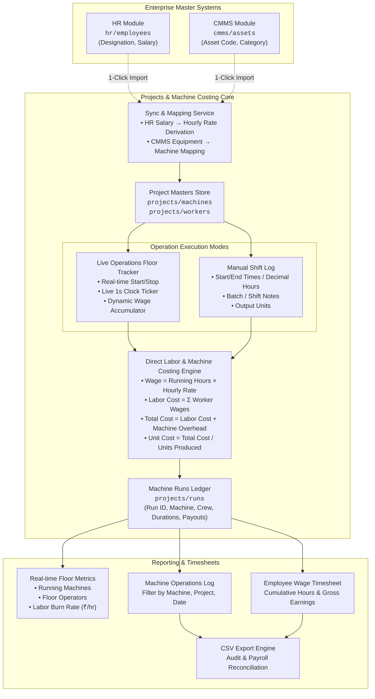
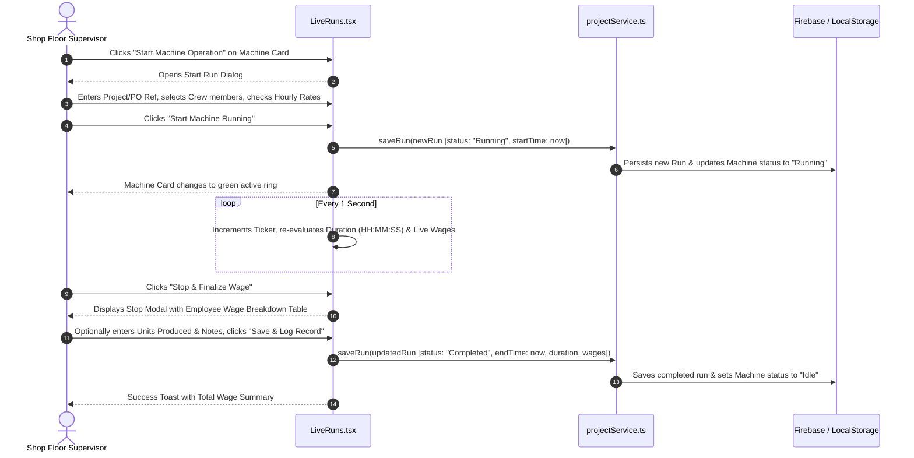
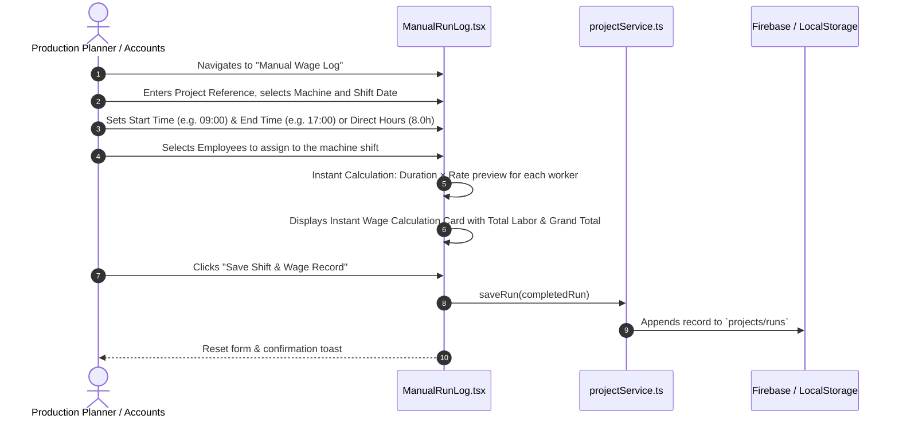
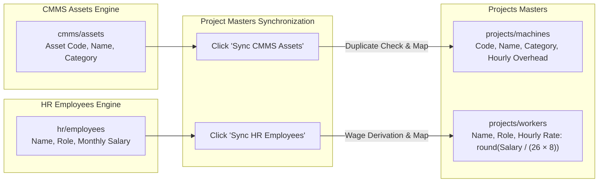

# FCS ERP Projects & Machine Costing Module
## Architecture, Workflows, Data Models & Operational Guide

---

## 1. Executive Overview & System Philosophy

The **Projects & Machine Costing Module** in Texa FAS ERP provides direct labor costing, operational machine runtime tracking, multi-operator crew allocation, and granular job timesheet management for manufacturing and precision engineering environments.

### Core Objectives
1. **Direct Labor & Machine Hour Costing**: Accurately capture labor cost at the physical machine station by linking machine running duration with assigned operators and wage rates.
2. **Dual-Mode Operational Tracking**:
   - **Real-Time Live Mode**: Station-side start/stop timers with 1-second interval execution and live-accumulating labor wage counters.
   - **Manual Shift Entry**: Post-shift or retrospective logging with automatic runtime computation from start/end times or direct decimal hours.
3. **Multi-Operator Team Allocation**: Support 1 or more employees per machine run (e.g., 1 Lead CNC Operator + 2 Helpers) with distinct wage rates.
4. **Decoupled Flexibility with Cross-Module Sync**:
   - Allows instant creation and modification of machines and workers on the shop floor without rigid administrative bottlenecks.
   - Provides 1-click synchronization to pull equipment assets from **CMMS** (`cmms/assets`) and employee records with wage rate derivations from **HR** (`hr/employees`).
5. **Deterministic Arithmetic**:
   - All wage and cost calculations follow explicit formulas with rounding to 2 decimal places or nearest integer currency.

---

## 2. End-to-End System Architecture



---

## 3. Mathematical & Costing Formulas

### 1. Machine Running Time Calculation
$$\text{Duration (Hours)} = \begin{cases} 
\frac{\text{Ticker Timestamp (ms)} - \text{Start Timestamp (ms)}}{3,600,000} & \text{(Live Run Mode)} \\
\frac{\text{End Time (minutes)} - \text{Start Time (minutes)}}{60} & \text{(Manual Time Mode)} \\
\text{Direct Decimal Input} & \text{(Direct Input Mode)}
\end{cases}$$

### 2. Individual Employee Wage Calculation
For each assigned employee $i \in \{1, 2, \dots, n\}$:
$$\text{Wage Earned}_i = \text{round}\left(\text{Duration (Hours)} \times \text{Hourly Wage Rate}_i\right)$$

### 3. Total Machine Labor Cost
$$\text{Total Labor Cost} = \sum_{i=1}^{n} \text{Wage Earned}_i$$

### 4. Machine Operating Overhead (Optional)
$$\text{Machine Cost} = \text{round}\left(\text{Duration (Hours)} \times \text{Machine Hourly Overhead Rate}\right)$$

### 5. Grand Total Operation Cost
$$\text{Total Cost} = \text{Total Labor Cost} + \text{Machine Cost}$$

### 6. Unit Production Cost (When units are specified)
$$\text{Cost per Unit} = \frac{\text{Total Cost}}{\text{Units Produced}}$$

---

## 4. Data Models & Schemas

### 4.1 Machine Entity (`ProjectMachine`)
Stored in `projects/machines` and synchronized in local persistence.

```typescript
export interface ProjectMachine {
  id: string;               // Unique ID: "m-01" or "m-cmms-{id}"
  name: string;             // Human-readable machine name (e.g. "CNC Machining Center")
  code: string;             // Machine asset code (e.g. "VMC-01")
  category?: string;        // Functional group: "CNC Milling", "Press", "Turning"
  status: MachineStatus;    // "Idle" | "Running" | "Under Maintenance"
  hourlyCost?: number;      // Power/operating overhead per hour (₹)
  operatorCapacity?: number;// Standard operator staffing capacity
  location?: string;        // Shop floor location (e.g. "Bay A - Milling Line")
  notes?: string;           // Operational notes or specifications
  createdAt?: number;       // Unix epoch timestamp
}
```

### 4.2 Worker / Employee Entity (`ProjectWorker`)
Stored in `projects/workers`.

```typescript
export interface ProjectWorker {
  id: string;               // Unique ID: "w-01" or "w-hr-{id}"
  name: string;             // Full name (e.g. "Rajesh Sharma")
  code?: string;            // Employee code (e.g. "EMP-101")
  role: string;             // Designation (e.g. "Lead CNC Operator", "Helper")
  hourlyRate: number;       // Default hourly wage rate in INR (₹)
  contact?: string;         // Contact phone number
  department?: string;      // Assigned department (e.g. "Machining")
  isContract?: boolean;     // True for contractor / daily-wager, false for permanent
  createdAt?: number;       // Unix epoch timestamp
}
```

### 4.3 Assigned Employee Snapshot (`AssignedEmployee`)
Embedded inside each run record to preserve historical wage calculations even if the worker's base hourly rate changes in the future.

```typescript
export interface AssignedEmployee {
  employeeId: string;       // Reference to ProjectWorker.id
  name: string;             // Worker name at time of run
  role: string;             // Role on machine (e.g. "Lead Operator")
  hourlyRate: number;       // Agreed hourly rate for this run session (₹)
  wageEarned: number;       // Computed payout: round(Duration * HourlyRate)
}
```

### 4.4 Machine Run Record (`MachineRun`)
Stored in `projects/runs`.

```typescript
export interface MachineRun {
  id: string;               // Unique ID: "run-{timestamp}"
  runNumber: string;        // Formatted identifier: "RUN-2026-001"
  projectName: string;      // Work order or project name (e.g. "PO-892 Valve Machining")
  machineId: string;        // Reference to ProjectMachine.id
  machineName: string;      // Machine name at time of run
  machineCode?: string;     // Machine code (e.g. "VMC-01")
  status: RunStatus;        // "Running" | "Completed" | "Cancelled"
  startTime: string;        // ISO 8601 string or datetime-local
  endTime?: string;         // ISO 8601 string or datetime-local
  durationHours: number;    // Decimal runtime hours (e.g. 4.50)
  assignedEmployees: AssignedEmployee[]; // Array of assigned workers & computed wages
  totalLaborCost: number;   // Sum of all assigned employee wages (₹)
  machineHourlyRate?: number;// Overhead rate applied (₹/hr)
  machineCost?: number;     // Machine overhead total (₹)
  totalCost: number;        // totalLaborCost + machineCost (₹)
  unitsProduced?: number;   // Optional completed physical piece count
  notes?: string;           // Operator notes, quality remarks, batch ID
  createdBy?: string;       // User who logged/started the run
  createdAt: number;        // Epoch timestamp
}
```

---

## 5. Detailed Operational Workflows

### 5.1 Workflow 1: Real-Time Live Machine Run



### 5.2 Workflow 2: Manual Past Shift Logging



### 5.3 Workflow 3: Cross-Module Sync (CMMS Assets & HR Staff)



---

## 6. Frontend Component Architecture

```
src/
├── modules/
│   └── projects/
│       ├── types.ts              # Data interfaces (Machine, Worker, Run, Crew)
│       ├── seedData.ts           # Demo seed data (Machines, Operators, Runs)
│       ├── projectService.ts     # Persistence layer (Firebase RTDB + LocalStorage)
│       ├── ProjectsLayout.tsx    # Shell component with Header, Clock, Subtab Pills
│       ├── LiveRuns.tsx          # Real-time machine cards & timer ticker
│       ├── ManualRunLog.tsx      # Retrospective shift logging with instant calculator
│       ├── WageSummary.tsx       # KPI cards, run history table, employee timesheets & CSV
│       └── ProjectMasters.tsx    # Machine & Employee CRUD and CMMS/HR sync
├── components/
│   └── layout/
│       └── Sidebar.tsx           # Navigation link with FolderKanban icon
├── context/
│   └── AuthContext.tsx           # Role permissions and version carry-forward
└── pages/
    └── Settings.tsx              # System privileges configuration
```

### Component Responsibilities

| Component | Responsibility |
| :--- | :--- |
| **`ProjectsLayout.tsx`** | Provides unified top-bar branding, `LiveClock`, and tab navigation pills to switch views. |
| **`LiveRuns.tsx`** | Manages live operations, real-time 1-second timer state, pulsing status indicators, start run modals, and wage finalization modals. |
| **`ManualRunLog.tsx`** | Handles single-screen shift logging with start/end time diff calculation or direct hours input, crew rate overrides, and live math preview. |
| **`WageSummary.tsx`** | Renders KPI analytics, search/filter table, employee payout aggregation across all machines, and CSV export. |
| **`ProjectMasters.tsx`** | Provides dedicated CRUD dialogs for machines and workers, plus one-click synchronization hooks with CMMS and HR. |
| **`projectService.ts`** | Encapsulates data fetching, fallback caching, duplicate prevention, and machine status synchronization. |

---

## 7. Security, Roles & Permissions

Access to the Projects module is governed by the centralized `AuthContext` and role permissions matrix in `localStorage`:

| System Role | Default Access | Capabilities |
| :--- | :---: | :--- |
| **Admin** | Full Access | Start/Stop runs, Manual logging, Master additions, CSV exports, Deletions. |
| **Production Head** | Full Access | Start/Stop runs, Crew assignments, Shift logging, Timesheet inspection. |
| **Manager** | Full Access | Operational oversight, wage calculations, report exports. |
| **Maintenance** | Restricted | Machine status visibility via CMMS synchronization. |
| **HR / Accounts** | Read / Report | Access timesheet summaries for payroll reconciliation. |

### Versioning & Upgrade Safety
In `AuthContext.tsx`, an automatic version carry-forward is implemented:
```typescript
if (version < 7) carryForward.push('projects');
```
This ensures that existing saved browser profiles automatically receive the new Projects tab without requiring users to clear their storage.

---

## 8. Operational Verification & Testing Guide

| # | Test Case | Action | Expected Result |
| :-: | :--- | :--- | :--- |
| **1** | **Live Start Run** | Click "Start Machine Operation" on an idle machine, select 2 workers, click start. | Machine status changes to "Running" with pulsing badge. Timer begins ticking in `HH:MM:SS`. |
| **2** | **Live Wage Accumulation** | Allow running timer to tick for several seconds. | Total Wages counter dynamically increases based on elapsed time and operator rates. |
| **3** | **Stop & Calculate** | Click "Stop & Finalize Wage" on a running machine. | Breakdown table shows exact hours and calculated wage ($Hours \times Rate$) per employee. |
| **4** | **Manual Shift Log** | In "Manual Wage Log", enter 4.0 hours with Worker A (₹150) and Worker B (₹100). | Live preview calculates Worker A: ₹600, Worker B: ₹400, Total Labor: ₹1,000. |
| **5** | **Employee Timesheet** | Navigate to "Wage Summary & Logs" $\rightarrow$ "Employee Wage Payouts". | Aggregates all machine hours and displays cumulative earnings per operator. |
| **6** | **Manual Masters** | In "Machines & Workers", manually add a new machine and custom worker. | New machine and worker immediately appear in run dropdowns and assignment dialogs. |
| **7** | **CMMS & HR Sync** | Click "Sync CMMS Assets" and "Sync HR Employees". | Automatically imports existing assets and staff without creating duplicates. |

